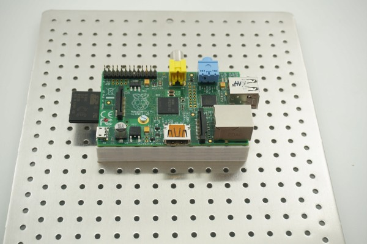

# Raspberry Pi 3 - MLAB assimilation breakout frame

Documents and design files describing a method of how to use classic Raspberry Pi 3 in MLAB prototyping system.
<!--- ELead ---> 

 

​
​
<!--- Description --->
<!--- EDescription --->
<!--- Content --->
<!--- EContent --->
            
